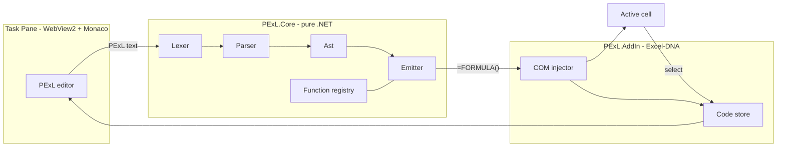

<div align="center">


**Write Excel logic the way you think it. PExL transpiles elegant, English-like code into native Excel formulas.**

`take this → do that → put it there`

[Quick start](#quick-start) · [Tutorial](#tutorial) · [Cheat sheet](#cheat-sheet) · [Glossary](#language-reference-the-complete-glossary) · [Add-in guide](#using-the-add-in-editor--ribbon) · [Why PExL](#why-pexl) · [How it works](#how-it-works) · [Spec](docs/language-spec.md)

</div>

---

## What is PExL?

Excel has 500+ functions and a syntax that punishes anyone who didn't memorize it.
Nesting `IF`s, decoding someone else's `=INDEX(MATCH(...))`, or remembering the
argument order of `TEXTJOIN` is a daily tax on millions of people.

**PExL** is a small, readable language that compiles to real Excel formulas. You
write logic that reads like a sentence; PExL emits a standard `=FORMULA(...)` and
drops it straight into the cell. The result is plain Excel - it keeps working even
for people who have never heard of PExL, and there is zero performance cost.

```pexl
B2 |> split.First("-") :: parts
parts |> fromLeft  -> C2
parts |> fromRight -> D2
```

compiles to

```excel
C2:  =TEXTBEFORE(B2,"-")
D2:  =TEXTAFTER(B2,"-")
```

It ships as an **offline Excel add-in** (built on Excel-DNA) with a built-in
code editor, so it works inside locked-down corporate environments where modern
web add-ins are blocked.

---

## Why PExL?

| Pain in raw Excel                                    | With PExL                                          |
| ---------------------------------------------------- | -------------------------------------------------- |
| Memorize 500+ function names and argument orders     | ~35 readable verbs cover the vast majority of work |
| Cryptic nested formulas nobody can maintain          | Pipelines that read top-to-bottom like sentences   |
| `VLOOKUP` vs `INDEX/MATCH` vs `XLOOKUP` confusion     | One `find ... within ... thenReturn ...`           |
| Repetitive data-wrangling done by hand every day     | One-click templates that also teach you the code   |
| "What does this formula even do?"                    | Your original PExL is saved with the cell          |

---

## Quick start

> Requires Excel for Windows and the [WebView2 runtime](https://developer.microsoft.com/microsoft-edge/webview2/) (already present on modern Windows).

1. Build the add-in (see [Building](#building)).
2. Load the `.xll` that matches your Excel bitness — for 64-bit Excel that's
   `src/PExL.AddIn/bin/x64/Release/net48/PExL64.xll`. In Excel:
   **File → Options → Add-ins → Manage: Excel Add-ins → Browse**, and select it.
3. A **PExL** tab appears in the ribbon. Click **Open Editor** (or right-click any
   cell → **Edit with PExL**).
4. Type a line of PExL, click a cell to drop its reference in, and hit **Preview**,
   then **Apply** to write the formula.

> **Add-in won't load?** On locked-down/corporate machines you may see
> `Loading ExcelDna.ManagedHost failed: 0x80070005` (access denied — usually
> antivirus or policy). Run **`tools/fix-load.ps1` as administrator**: it unblocks
> the files, adds a Windows Defender exclusion, and prints the exact `.xll` to load
> for your Excel bitness.

---

## Tutorial

A five-minute tour. Each example shows the PExL on the left and the Excel formula
PExL generates on the right.

### 1. The pipe: `|>`

The pipe feeds a value into the next step as its first argument. Read it as "then".

```pexl
B2 |> trim |> upper          ->  =UPPER(TRIM(B2))
```

> `B2 |> upper` is identical to `upper(B2)`. Use whichever reads better.

### 2. Output: `->`

`->` writes the result into a cell. It only ever means "put it here".

```pexl
B2 |> upper -> C2            (C2 gets  =UPPER(B2) )
```

Fill a whole column at once - relative references adjust like the fill handle:

```pexl
B2 |> upper -> C2:C100
```

### 3. Naming a result: `::`

`::` captures a value under a name so you can reuse it on later lines.

```pexl
B2 |> split.First("-") :: parts
parts |> fromLeft  -> C2     ->  =TEXTBEFORE(B2,"-")
parts |> fromRight -> D2     ->  =TEXTAFTER(B2,"-")
```

### 4. Looking things up

Forget `VLOOKUP`. One verb, reads like English:

```pexl
find D2 within A1:A100 thenReturn B1:B100 ifMissing "N/A" -> E2
```
```excel
=XLOOKUP(D2,A1:A100,B1:B100,"N/A")
```

### 5. Conditionals

```pexl
if B2 > 10 then "High" else "Low"      ->  =IF(B2>10,"High","Low")
```

Multi-branch without the nested-`IF` nightmare:

```pexl
check B2:
  if > 90 then "A"
  if > 80 then "B"
  else "C"
```
```excel
=IFS(B2>90,"A",B2>80,"B",TRUE,"C")
```

### 6. Conditional sums

```pexl
sumWhere(A1:A10, B1:B10 > 100 and C1:C10 = "West")
```
```excel
=SUMIFS(A1:A10,B1:B10,">100",C1:C10,"West")
```

### 7. The escape hatch

Any of Excel's other ~460 functions are one call away:

```pexl
raw("SUMPRODUCT", A1:A10, B1:B10)   ->  =SUMPRODUCT(A1:A10,B1:B10)
legacy.vlookup(D2, A1:B100, 2)      ->  =VLOOKUP(D2,A1:B100,2,FALSE)
```

---

## Before / after

A real formula from the wild: pull a `start-end` time window out of a `"date, HH:MM-HH:MM"`
cell and return the number of hours. **Before** (what you actually have to write and maintain):

```excel
=IF(F7="x", "x", IFERROR((TIMEVALUE(TRIM(MID(TRIM(MID(F7, FIND(",", F7)+1, 99)),
  FIND("-", TRIM(MID(F7, FIND(",", F7)+1, 99)))+1, 99)))
  - TIMEVALUE(TRIM(LEFT(TRIM(MID(F7, FIND(",", F7)+1, 99)),
  FIND("-", TRIM(MID(F7, FIND(",", F7)+1, 99)))-1)))) * 24, 0))
```

**After** (PExL - each step named, read top to bottom):

```pexl
// grab the "start-end" window after the comma, then split it
F7 |> split.First(",") |> fromRight |> trim :: window
window |> split.First("-") |> fromLeft  |> trim :: startTime
window |> split.First("-") |> fromRight |> trim :: endTime

// "x" rows pass through; anything unparseable falls back to 0
check
  F7 = "x" then "x"
  else ifError((raw("TIMEVALUE", endTime) - raw("TIMEVALUE", startTime)) * 24, 0)
-> G7
```

Same result, but you can actually see what each piece does — and tweak one line without
re-counting parentheses.

---

A simpler "clean this column" task. **Before** (what you'd type in Excel):

```excel
=PROPER(TRIM(SUBSTITUTE(A2,"_"," ")))
```

**After** (PExL - read it left to right):

```pexl
A2 |> replace("_", " ") |> trim |> proper -> B2
```

Extracting a domain from an email, then checking it:

```pexl
A2 |> split.Last("@") |> fromRight :: domain
if domain endsWith ".com" then "external" else "internal" -> B2
```
```excel
B2:  =IF(RIGHT(TEXTAFTER(A2,"@",-1),4)=".com","external","internal")
```

---

## Cheat sheet

| Category   | PExL                                              | Excel                                  |
| ---------- | ------------------------------------------------- | -------------------------------------- |
| Lookup     | `find x within R thenReturn S`                    | `XLOOKUP(x,R,S)`                       |
| Position   | `position x within R`                             | `MATCH(x,R,0)`                         |
| Split      | `t \|> split.First("-") \|> fromLeft`             | `TEXTBEFORE(t,"-")`                    |
| Join       | `combine(A,B) with("-")`                          | `TEXTJOIN("-",TRUE,A,B)`               |
| Clean      | `t \|> trim \|> proper`                           | `PROPER(TRIM(t))`                      |
| Contains   | `t contains "x"`                                  | `ISNUMBER(SEARCH("x",t))`              |
| If         | `if c then a else b`                              | `IF(c,a,b)`                            |
| Multi-if   | `check x: if > 9 then "A" else "B"`               | `IFS(x>9,"A",TRUE,"B")`                |
| Error      | `expr \|> ifError("-")`                           | `IFERROR(expr,"-")`                    |
| Sum-if     | `sumWhere(A, B > 100)`                            | `SUMIFS(A,B,">100")`                   |
| Count      | `count(A)` / `countNum(A)`                        | `COUNTA(A)` / `COUNT(A)`               |
| Filter     | `filter(R) where(B > 100)`                        | `FILTER(R,B>100)`                      |
| Unique     | `unique(R)`                                       | `UNIQUE(R)`                            |
| Date       | `addMonths(A2, 3)`                                | `EDATE(A2,3)`                          |
| Round      | `round(A2, 2)`                                    | `ROUND(A2,2)`                          |
| Anything   | `raw("FUNC", ...)`                                | `=FUNC(...)`                           |

Full reference: [docs/language-spec.md](docs/language-spec.md).

---

## Language reference (the complete glossary)

This is the no-stone-unturned reference: **every symbol, every keyword, every verb**,
each with what it does and a worked example. If you're brand new, read [Tutorial](#tutorial)
first, then keep this open as you write.

### How to read an entry

Each example shows PExL on the left and the Excel formula it compiles to on the right:

```pexl
B2 |> trim |> proper          ->   =PROPER(TRIM(B2))
```

A PExL statement is always one of these shapes (the last two parts are optional):

```
EXPRESSION                 just compute a value
EXPRESSION -> C2            …and write it to a cell/range
EXPRESSION :: name          …and remember it under a name for later lines
```

### A. Symbols & operators

| Symbol | Name | What it does | Example → Excel |
| ------ | ---- | ------------ | --------------- |
| `\|>` | **pipe** | Feeds the value on the left in as the **first argument** of the verb on the right. Read it as "then". `x \|> f(y)` is identical to `f(x, y)`. | `B2 \|> upper` → `=UPPER(B2)` |
| `->` | **output** | Writes the result to a cell or range. Output-only — it never means anything else. | `B2 \|> upper -> C2` writes `=UPPER(B2)` into C2 |
| `::` | **bind** | Captures the current value under a name so later lines can reuse it. The name is a compile-time alias (it gets inlined). | `B2 \|> split.First("-") :: parts` |
| `//` | **comment** | Everything after `//` on a line is ignored by the compiler (but kept in the editor). | `// clean the column` |
| `( )` | **grouping / arguments** | Group sub-expressions to control precedence, and wrap verb arguments. | `(A1 + B1) * 2`, `round(A2, 2)` |
| `.` | **modifier** | Selects a variant of a verb. | `split.First`, `replace.last`, `round.up`, `dateDiff.years`, `legacy.vlookup` |
| `,` | **separator** | Separates arguments, and can separate statements on one line. | `combine(A2, B2)` |
| `"…"` | **string** | A text literal. | `"West"` |
| `` `…` `` | **raw string** | A text literal where inner double-quotes are literal — no escaping. Use when your text contains `"`. | `` `say "hi"` `` |
| `#…#` | **date literal** | An ISO date. | `#2024-01-31#` → `=DATE(2024,1,31)` |
| `%` | **percent** | Number suffix; `10%` means `0.1`. | `10%` |
| `+ - * / ^` | **arithmetic** | Add, subtract, multiply, divide, power. | `A1 * 1.2`, `A1 ^ 2` |
| `= <> != > < >= <=` | **comparison** | Equality/inequality/ordering. `!=` and `<>` are the same. | `B2 >= 90` |
| `:` | **range** | Excel range between two refs (also whole column/row). | `A1:B10`, `A:A`, `1:1` |
| `$` | **absolute ref** | Standard Excel absolute marker; passes through. | `$A$1` |
| `!` | **sheet qualifier** | References a cell on another sheet. | `Sheet2!A1`, `'My Sheet'!A1` |

### B. Keywords & natural phrasing

Structural keywords are **lowercase**. Verbs are case-insensitive (`Split` = `split`).
A handful of **filler words** are ignored anywhere so natural phrasing parses.

| Word(s) | Role | Example → Excel |
| ------- | ---- | --------------- |
| `if` … `then` … `else` | Inline conditional. | `if B2 > 10 then "High" else "Low"` → `=IF(B2>10,"High","Low")` |
| `check` | Multi-branch conditional (see [check](#check) below). | `check\n  B2 >= 90 then "A"\n  else "F"` |
| `return` | Optional/cosmetic — marks the produced value. | `return A1 + B1` |
| `true` / `false` | Boolean literals. | `true` → `TRUE` |
| `empty` | An empty string. | `empty` → `""` |
| `and` / `or` / `not` | Boolean logic. | `A1 > 0 and B1 > 0` → `=AND(A1>0,B1>0)` |
| `is` / `is not` | Aliases for `=` / `<>`. | `A1 is "West"` → `A1="West"` |
| `contains` | Substring test (case-insensitive). | `B2 contains "x"` → `=ISNUMBER(SEARCH("x",B2))` |
| `startsWith` / `endsWith` | Prefix/suffix test. | `B2 startsWith "USD"` → `=LEFT(B2,3)="USD"` |
| `within` | The "haystack" range in a lookup. | `find D2 within A1:A100 …` |
| `thenReturn` | The "result" range in a lookup. | `… thenReturn B1:B100` |
| `ifMissing` | Fallback when a lookup finds nothing. | `… ifMissing "N/A"` |
| `inTable` / `returnColumn` | Table-style lookup by column number. | `find D2 inTable A1:D100 returnColumn 3` |
| `where` | The condition for `filter`. | `filter(A1:C100) where(B1:B100 > 100)` |
| `by` | The sort key for `sort`. | `sort(A1:C100) by(2)` |
| `with` | The separator for `combine`. | `combine(A,B) with("-")` |
| `descending` / `ascending` | Sort direction. | `sort(R) by(1) descending` |
| `from` / `of` | Prepositional filler / readability. | `yearOf(A2)` |
| `the`, `value`, `in`, `please`, `a` | **Filler** — ignored so prose parses. | `find the value D2 within A1:A100` |

### C. Verbs — Text

| PExL | What it does | → Excel |
| ---- | ------------ | ------- |
| `B2 \|> split.First("-")` | Split at the **first** delimiter (binary). | (pairs with an extractor below) |
| `B2 \|> split.Last("-")` | Split at the **last** delimiter (binary). | |
| `B2 \|> split("-")` | Split on **all** delimiters (array). | |
| `… \|> fromLeft` | Keep the piece to the **left** of the split. | `=TEXTBEFORE(B2,"-")` |
| `… \|> fromRight` | Keep the piece to the **right** of the split. | `=TEXTAFTER(B2,"-")` |
| `… \|> at(2)` | Keep the piece at a 1-based index. | `=INDEX(TEXTSPLIT(B2,"-"),2)` |
| `… \|> spill` | Spread all pieces across adjacent cells. | `=TEXTSPLIT(B2,"-")` |
| `combine(A1,B1) with("-")` | Join values, skipping blanks. | `=TEXTJOIN("-",TRUE,A1,B1)` |
| `trim(B2)` | Remove leading/trailing/duplicate spaces. | `=TRIM(B2)` |
| `clean(B2)` | Strip non-printable characters. | `=CLEAN(B2)` |
| `upper(B2)` / `lower(B2)` / `proper(B2)` | Change case. | `=UPPER/LOWER/PROPER(B2)` |
| `replace(B2,"-","_")` | Replace **all** occurrences. | `=SUBSTITUTE(B2,"-","_")` |
| `replace.first(B2,"-","_")` | Replace the **first** occurrence. | `=SUBSTITUTE(B2,"-","_",1)` |
| `replace.last(B2,"-","_")` | Replace the **last** occurrence. | `=SUBSTITUTE(B2,"-","_",<count>)` |
| `replace.nth(2,B2,"-","_")` | Replace the **nth** occurrence. | `=SUBSTITUTE(B2,"-","_",2)` |
| `contains(B2,"x")` | Substring test (case-insensitive). | `=ISNUMBER(SEARCH("x",B2))` |
| `startsWith(B2,"USD")` | Prefix test. | `=LEFT(B2,3)="USD"` |
| `endsWith(B2,".csv")` | Suffix test. | `=RIGHT(B2,4)=".csv"` |
| `length(B2)` | Character count. | `=LEN(B2)` |

> **Default sides:** with no `.First`/`.Last`, `fromLeft` is the first piece and `fromRight` is the last.

### D. Verbs — Lookup

| PExL | What it does | → Excel |
| ---- | ------------ | ------- |
| `find D2 within A1:A100 thenReturn B1:B100` | Look `D2` up and return the matching row from another range. | `=XLOOKUP(D2,A1:A100,B1:B100)` |
| `… ifMissing "N/A"` | Add a fallback when nothing matches. | `=XLOOKUP(…,"N/A")` |
| `D2 \|> find(A1:A100, B1:B100)` | Concise pipe form, same result. | `=XLOOKUP(D2,A1:A100,B1:B100)` |
| `find.wildcard D2 within …` | Enable `*`/`?` wildcard matching. | `=XLOOKUP(…,,2)` |
| `find.approx D2 within …` | Approximate (next-smaller) match. | `=XLOOKUP(…,,-1)` |
| `find.reverse D2 within …` | Search from the bottom up. | `=XLOOKUP(…,,,-1)` |
| `find D2 inTable A1:D100 returnColumn 3` | Table form: return the Nth column. | `=XLOOKUP(D2,A1:A100,C1:C100)` |
| `position D2 within A1:A100` | Get the **position** (index) of a match. | `=MATCH(D2,A1:A100,0)` |

### E. Verbs — Logic

| PExL | What it does | → Excel |
| ---- | ------------ | ------- |
| `if c then a else b` | Inline conditional. | `=IF(c,a,b)` |
| <a id="check"></a>`check` block | Multi-branch logic (see below). | `=IFS(...)` |
| `expr \|> ifError("-")` | Replace an error with a fallback. | `=IFERROR(expr,"-")` |
| `A1 > 0 and B1 > 0` | Boolean AND. | `=AND(A1>0,B1>0)` |
| `A1 > 0 or B1 < 5` | Boolean OR. | `=OR(A1>0,B1<5)` |
| `not contains(B2,"x")` | Boolean NOT. | `=NOT(ISNUMBER(SEARCH("x",B2)))` |

The **`check`** block replaces nested `IF`s. The first matching line wins; `else` is the fallback.
Three equivalent forms are accepted — plain, with a leading `if`, or with a shared subject:

```pexl
check                         check                       check B2:
  B2 >= 90 then "A"             if B2 >= 90 then "A"         if >= 90 then "A"
  B2 >= 80 then "B"             if B2 >= 80 then "B"         if >= 80 then "B"
  else "C"                      else "C"                     else "C"
-> D2
```

All compile to `=IFS(B2>=90,"A",B2>=80,"B",TRUE,"C")`. (The **Translate Formula** button turns an
existing nested-`IF`/`IFS` formula *back* into this `check` form.)

### F. Verbs — Aggregation

| PExL | What it does | → Excel |
| ---- | ------------ | ------- |
| `sum(A1:A10)` | Add numbers. | `=SUM(A1:A10)` |
| `avg(A1:A10)` | Average. | `=AVERAGE(A1:A10)` |
| `min(A1:A10)` / `max(A1:A10)` | Smallest / largest. | `=MIN/MAX(A1:A10)` |
| `count(A1:A10)` | Count **non-empty** cells. | `=COUNTA(A1:A10)` |
| `countNum(A1:A10)` | Count **numeric** cells. | `=COUNT(A1:A10)` |
| `sumWhere(A1:A10, B1:B10 > 100)` | Conditional sum. | `=SUMIFS(A1:A10,B1:B10,">100")` |
| `sumWhere(A, B > 100 and C = "West")` | Multiple conditions. | `=SUMIFS(A,B,">100",C,"West")` |
| `countWhere(B1:B10 = "West")` | Conditional count. | `=COUNTIFS(B1:B10,"West")` |
| `avgWhere(A1:A10, B1:B10 >= 50)` | Conditional average. | `=AVERAGEIFS(A1:A10,B1:B10,">=50")` |
| `sum.ignoreErrors(A1:A10)` | Sum, skipping error cells. | `=AGGREGATE(9,6,A1:A10)` |

### G. Verbs — Dates

| PExL | What it does | → Excel |
| ---- | ------------ | ------- |
| `today()` / `now()` | Current date / date-time. | `=TODAY()` / `=NOW()` |
| `addDays(A2, 7)` | Add days. | `=A2+7` |
| `addMonths(A2, 3)` | Add months. | `=EDATE(A2,3)` |
| `addYears(A2, 1)` | Add years. | `=EDATE(A2,12)` |
| `yearOf(A2)` / `monthOf(A2)` / `dayOf(A2)` | Extract part. | `=YEAR/MONTH/DAY(A2)` |
| `weekdayOf(A2)` | Day of week. | `=WEEKDAY(A2)` |
| `dateDiff(A2, B2)` | Difference in **days**. | `=DATEDIF(A2,B2,"d")` |
| `dateDiff.months(A2, B2)` / `dateDiff.years(A2, B2)` | Difference in months / years. | `=DATEDIF(A2,B2,"m"/"y")` |
| `Date("2024-01-31")` | Parse a date from text (ISO assumed). | `=DATE(2024,1,31)` |

> **Heads-up:** `DATEDIF` requires `start <= end`. For dates that might be in the future,
> use `dateDiff.years(min(A2, today()), max(A2, today()))`.

### H. Verbs — Math

| PExL | What it does | → Excel |
| ---- | ------------ | ------- |
| `round(A2, 2)` | Round to N digits. | `=ROUND(A2,2)` |
| `round.up(A2, 2)` / `round.down(A2, 2)` | Round up / down. | `=ROUNDUP/ROUNDDOWN(A2,2)` |
| `abs(A2)` | Absolute value. | `=ABS(A2)` |
| `sqrt(A2)` | Square root. | `=SQRT(A2)` |
| `power(A2, 3)` | Raise to a power. | `=POWER(A2,3)` |
| `mod(A2, 3)` | Remainder. | `=MOD(A2,3)` |

### I. Verbs — Filter & shape (dynamic arrays, Excel 365/2021+)

| PExL | What it does | → Excel |
| ---- | ------------ | ------- |
| `filter(A1:C100) where(B1:B100 > 100)` | Keep rows matching a condition. | `=FILTER(A1:C100,B1:B100>100)` |
| `sort(A1:C100) by(2)` | Sort by a column. | `=SORT(A1:C100,2)` |
| `sort(A1:C100) by(2) descending` | Sort descending. | `=SORT(A1:C100,2,-1)` |
| `unique(A1:A100)` | Distinct values. | `=UNIQUE(A1:A100)` |
| `take(A1:A100, 5)` | First N rows. | `=TAKE(A1:A100,5)` |

### J. References & helpers

| PExL | What it does | → Excel |
| ---- | ------------ | ------- |
| `col("A")` | Whole-column reference. | `A:A` |
| `row(2)` | Whole-row reference. | `2:2` |
| `cell("C", 2)` | Build an A1 ref from column + row. | `C2` |
| `fixed(A1)` / `fixed(A1:B2)` | Lock a reference with absolutes. | `$A$1` / `$A$1:$B$2` |

### K. Escape hatches — reach any Excel function

PExL's ~50 verbs cover the common 90%. For everything else, two escape hatches reach all ~460
remaining functions:

| PExL | What it does | → Excel |
| ---- | ------------ | ------- |
| `raw("SUMPRODUCT", A1:A10, B1:B10)` | Emit any function verbatim, args in order. | `=SUMPRODUCT(A1:A10,B1:B10)` |
| `legacy.vlookup(D2, A1:B100, 2)` | Call a legacy function by name (adds `FALSE` for exact match on V/HLOOKUP). | `=VLOOKUP(D2,A1:B100,2,FALSE)` |

---

## One-click templates

Beyond the language, the ribbon offers guided actions for the chores data folks do
daily. Each runs with a couple of clicks, defaults to a **live formula** (toggle to
paste values), and **drops the equivalent PExL into the editor so you learn as you go**.

- **Shaping** - Pivot Generator, Unpivot (wide→long), Group & Summarize, Transpose,
  Compare Two Lists, Merge/Join Tables
- **Cleaning** - Fill Blanks Down, Fix Numbers-Stored-as-Text, Standardize/Parse
  Dates, Bulk Find & Replace, Standardize Case
- **Insert / Analyze** - Quick Stats Card, Data Validation Dropdown, Fill Series,
  Rank / Percent-of-Total / Running Total, Conditional Formatting Presets
- **Core utilities** - Date Picker → Cell, Split-to-Columns, CSV/Paste Split,
  Remove Duplicates, Trim & Clean, Lookup Builder, Combine Columns

---

## Using the add-in (editor & ribbon)

Everything you can click, what it does, and how the pieces fit together. Two surfaces:
the **PExL ribbon tab** (one-click tools) and the **task panes** (the editor IDE and the
docs pane).

### The editor pane (your IDE)

Open it with **Open Editor** on the ribbon, or right-click a cell → **Edit with PExL**.
It's a full Monaco editor (the engine behind VS Code) running offline, with PExL syntax
highlighting, completions (Ctrl+Space), hovers, and signature help. Long lines **word-wrap**.

The toolbar across the top, left to right:

| Control | Type | What it does |
| ------- | ---- | ------------ |
| **Dark / Light** | button | Toggles the editor theme. Your choice is remembered between sessions. |
| **Use live cell refs** | checkbox | When **on**, clicking any cell or range in the sheet drops its reference into the editor at the cursor — and clicking another cell **replaces** that reference instead of appending. Great for building a formula by pointing. When **off**, your clicks navigate the sheet normally. |
| **Paste as values** | checkbox | When **on**, **Apply** writes the *computed result* (frozen values) instead of a live formula. When **off** (default), Apply writes the live `=FORMULA(...)` so it recalculates. |
| **Preview** | button | Compiles your PExL and shows the Excel formula(s) in the output pane below — without touching the sheet. Use it to check what you'll get. |
| **Apply → cell** | button | Compiles and writes the result straight to the target cell/range. No confirmation prompt. If your statement has no `-> target`, it writes to the currently selected cell. |

Below the toolbar:

- **The banner** ("This cell already has PExL" / "*Address* has saved PExL") appears when the
  selected cell has PExL you saved earlier. **Load it** pulls that PExL back into the editor so
  you can read or tweak it; **Dismiss** hides the banner. The links are styled for contrast in
  both themes.
- **The editor area** is where you type. Errors are reported with a line/column so you can jump
  to them.
- **The output pane** (bottom) shows the previewed formula, the "applied" confirmation, or a
  parse/compile error message.

### Translate Formula (the decompiler)

Select a cell that already contains a normal Excel formula, then click **Translate Formula**
(ribbon) or right-click → **Translate formula to PExL**. PExL reads the formula and rewrites it
as readable PExL in the editor — ideal for learning, auditing, or simplifying someone else's work.
Nested `IF`/`IFS` ladders come back as a clean multi-branch [`check`](#check) block.

### Undo PExL change

Excel wipes its own undo history whenever an add-in writes to the grid, so PExL keeps its **own**
undo stack — up to **100 steps**, tracked **per worksheet**. Click **Undo PExL change** to revert
the most recent PExL write on the *active sheet*; switching sheets switches to that sheet's history,
so undoing on one tab never disturbs another. The button greys out when there's nothing to undo.

### Help & Docs pane

Click **Help & Docs** to open a searchable reference of every tool and verb. Each card has:

- a plain description and a PExL snippet,
- **▶ Run** — write that formula to the sheet (same as **Apply → cell**),
- **View Excel formula** — preview the Excel equivalent without changing anything,
- **Try it yourself!** — create a fresh sheet pre-filled with a realistic sample dataset so you can
  run the example on real-looking data.

It has its own search box and theme toggle, matching the editor.

### Ribbon reference (every button)

The **PExL** tab, group by group. Most tools act **directly on your selection**: if a single cell
suits the action it writes there immediately; if it needs a range or more input, it opens the editor
**seeded with your current selection** (no more hard-coded `A1`/`A2`). Each also drops the equivalent
PExL into the editor so you learn the language as you work.

**Editor**

| Button | What it does |
| ------ | ------------ |
| **Open Editor** | Opens the editor task pane. |
| **Translate Formula** | Decompiles the selected cell's formula into PExL in the editor. |
| **Undo PExL change** | Reverts the last PExL write on the active sheet (per-sheet, 100 deep). |

**Text**

| Button | What it does |
| ------ | ------------ |
| **Split to Columns** | Break the selected cell on a delimiter into separate columns. |
| **Combine Columns** | Join several cells with a separator (`TEXTJOIN`). |
| **Trim & Clean** | Strip extra spaces + nonprintable characters from the cell on your left. |
| **CSV / Paste Split** | Spread one comma-separated cell across columns (`TEXTSPLIT`). |
| **Proper Case** | Title-case the cell on your left, after trimming. |
| **Email Domain** | Pull the part after the last `@` from the cell on your left. |

**Shape**

| Button | What it does |
| ------ | ------------ |
| **Remove Duplicates** | Distinct values from the selected range (`UNIQUE`). |
| **Sort By** | Sort the selected range by a key column (`SORT`). |
| **Filter Rows** | Keep only rows matching a condition (`FILTER`). |
| **Top N** | Take the highest N rows (`SORT` + `TAKE`). |
| **Fill Blanks Down** | Fill a blank cell from the value above it. |

**Lookup & Logic**

| Button | What it does |
| ------ | ------------ |
| **Lookup Builder** | `XLOOKUP` across sheets with a fallback, seeded from your cell. |
| **If / Check** | Multi-branch logic without nested `IF`s (`IFS`), your cell as the subject. |
| **Safe Divide** | Divide the two cells on your left, showing a dash instead of `#DIV/0!`. |

**Summarize**

| Button | What it does |
| ------ | ------------ |
| **Quick Stats** | Count, sum, average, min and max for the selected range. |
| **Sum Where** | Conditional total over your selection (`SUMIFS`). |
| **Pivot Generator** | Wizard: pick a group-by column + aggregation → spilled summary. |

**Dates**

| Button | What it does |
| ------ | ------------ |
| **Today** | Write today's date (`TODAY`) into the selected cell. |
| **Date Picker** | Pick a date on a calendar; it's written into the selected cell. |
| **Date Between** | Difference between the date on your left and today (`DATEDIF`); opens the editor with day/month/year variants. |

**Help**

| Button | What it does |
| ------ | ------------ |
| **Help & Docs** | Open the searchable documentation pane described above. |

**Right-click (cell context menu):** **Edit with PExL** (open the editor) and **Translate formula
to PExL** (decompile the selected formula).

---

## How it works



1. You write PExL in the Monaco editor (the engine behind VS Code), embedded
   offline in an Excel task pane.
2. `PExL.Core` runs a classic compiler pipeline - **lexer → parser → AST →
   emitter** - producing a native Excel formula string.
3. The add-in injects the formula into the active cell via COM and stores your
   original PExL with the cell so it round-trips.

PExL.Core has **no Excel dependency**, so the whole language is unit-tested in
isolation against golden `PExL → formula` cases.

---

## Project layout

```
PExL/
├─ src/
│  ├─ PExL.Core/         transpiler (netstandard2.0): Lexing, Parsing, Emit, StdLib
│  ├─ PExL.AddIn/        Excel-DNA add-in (net48): ribbon, task pane, COM
│  └─ PExL.Editor.Web/   Monaco editor assets + PExL syntax + JS↔C# bridge
├─ tests/
│  └─ PExL.Core.Tests/   golden transpiler tests (xUnit)
├─ docs/
│  └─ language-spec.md   the authoritative spec
└─ README.md
```

---

## Building

```bash
# from the repo root
dotnet build src/PExL.AddIn/PExL.AddIn.csproj -c Release -p:Platform=x64
```

This restores Excel-DNA, builds `PExL.Core`, and produces the add-in `.xll`
under `src/PExL.AddIn/bin/x64/Release/net48/`. The `.xll` loads its sibling
files from that folder (`PExL.Core.dll`, `Newtonsoft.Json.dll`, the
`Microsoft.Web.WebView2.*` assemblies, the loose `WebView2Loader.dll`, and the
`web/` editor assets), so distribute the whole folder. Load `PExL64.xll` in
Excel as described in [Quick start](#quick-start).

> Targets: `PExL.Core` is `netstandard2.0`; `PExL.AddIn` is `net48`
> (.NET Framework 4.8, Excel-DNA 1.9). Targeting the desktop CLR keeps the
> add-in from extracting a .NET host into `%TEMP%`, which is what tripped the
> corporate Defender ASR rule on the old .NET 8 build. WebView2 runtime is
> required at run time.

---

## Status & roadmap

PExL is under active development. The sequence:

- [x] Language design (v1 spec finalized)
- [x] Transpiler core (forward: PExL → formula) — 55 golden tests
- [x] Excel-DNA add-in: ribbon, Monaco task pane, COM injection
- [x] Live click-to-insert (click a cell/range to drop its reference in the editor)
- [x] Code preservation (your PExL saved with the cell, recalled on selection)
- [x] Full offline Monaco editor (vendored locally) with PExL highlighting, completions & hovers
- [x] Confirm-preview gate + paste-as-values option
- [x] Template library (one-click actions incl. Date Picker & Pivot wizards)
- [x] **Decompiler** — Translate Formula turns an existing formula back into readable PExL
- [x] Per-sheet undo (100 steps) for PExL writes
- [x] In-pane Help & Docs with live playground + "Try it yourself!" demo sheets
- [ ] Packaging & signed distribution

---

## FAQ

**Do recipients need the add-in to open my file?**
No. PExL only writes standard Excel formulas. The file works anywhere.

**Does it slow down my workbook?**
No. The output is native formulas; PExL isn't involved at recalculation time.

**Will it work in my locked-down corporate Excel?**
That's the point. It runs locally via Excel-DNA / COM and needs no network or
web-add-in permissions.

**Can I still use functions PExL doesn't have a verb for?**
Yes - `raw("ANYFUNCTION", args...)` reaches all of Excel.
