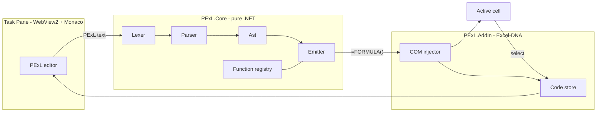

<div align="center">


**Write Excel logic the way you think it.** ✨
PExL transpiles elegant, English-like code into native Excel formulas.

`take this → do that → put it there`

[Quick start](#quick-start) · [Why PExL](#why-pexl) · [Cheat sheet](#cheat-sheet) · [How it works](#how-it-works) · [Building](#building) · [FAQ](#faq)

📖 **Full docs, glossary, tutorial & live playground →** open [`README.html`](README.html) in your browser
([rendered version](https://htmlpreview.github.io/?https://github.com/keeylogger/PExL/blob/main/README.html))

</div>

---

## Introduction

Excel has 500+ functions and a syntax that punishes anyone who didn't memorize it.
Nesting `IF`s, decoding someone else's `=INDEX(MATCH(...))`, or recalling the argument
order of `TEXTJOIN` is a daily tax on millions of people.

**PExL** (Plain Excel Language) is a small, readable language that compiles to real
Excel formulas. You write logic that reads like a sentence; PExL emits a standard
`=FORMULA(...)` and drops it straight into the cell. The output is plain Excel — it
keeps working for people who've never heard of PExL, with **zero** performance cost.

It ships as an **offline Excel add-in** (built on [Excel-DNA](https://excel-dna.net))
with a built-in code editor, so it runs inside locked-down corporate environments where
modern web add-ins are blocked.

> 🧰 **Stack:** `C#` / .NET (transpiler + Excel-DNA add-in) · `JavaScript` (Monaco editor
> integration + browser playground) · `HTML/CSS` (task panes & interactive docs).

---

## What is PExL?

A real formula from the wild: pull a `start-end` time window out of a
`"date, HH:MM-HH:MM"` cell and return the number of hours.

**Before** — what you actually have to write and maintain in Excel:

```excel
=IF(F7="x", "x", IFERROR((TIMEVALUE(TRIM(MID(TRIM(MID(F7, FIND(",", F7)+1, 99)),
  FIND("-", TRIM(MID(F7, FIND(",", F7)+1, 99)))+1, 99)))
  - TIMEVALUE(TRIM(LEFT(TRIM(MID(F7, FIND(",", F7)+1, 99)),
  FIND("-", TRIM(MID(F7, FIND(",", F7)+1, 99)))-1)))) * 24, 0))
```

**After** — the same logic in PExL, each step named, read top to bottom:

```pexl
// grab the "start-end" window after the comma, then split it
F7 |> split.First(",") |> fromRight |> trim :: window
window |> split.First("-") |> fromLeft  |> trim :: startTime
window |> split.First("-") |> fromRight |> trim :: endTime

// "x" rows pass through; anything unparseable falls back to 0
check
  F7 = "x" then "x"
  else ifError((raw("TIMEVALUE", endTime) - raw("TIMEVALUE", startTime)) * 24, 0)
-> G7
```

Same result — but you can actually *see* what each piece does, and tweak one line
without re-counting parentheses. 🎯

---

## Why PExL?

| Pain in raw Excel                                    | With PExL                                          |
| ---------------------------------------------------- | -------------------------------------------------- |
| Memorize 500+ function names and argument orders     | ~35 readable verbs cover the vast majority of work |
| Cryptic nested formulas nobody can maintain          | Pipelines that read top-to-bottom like sentences   |
| `VLOOKUP` vs `INDEX/MATCH` vs `XLOOKUP` confusion     | One `find ... within ... thenReturn ...`           |
| "What does this formula even do?"                    | Your original PExL is saved with the cell          |
| Web add-ins blocked by IT                            | Runs fully offline via Excel-DNA / COM             |

---

## Quick start

> Requires Excel for Windows (64-bit) and the
> [WebView2 runtime](https://developer.microsoft.com/microsoft-edge/webview2/)
> (already present on modern Windows).

1. Grab the latest [**release**](https://github.com/keeylogger/PExL/releases):
   - **`PExL-vX.Y.Z.zip`** — the full package (editor + docs panes included).
     Best for most people, and the only one that runs in restricted setups.
   - **`PExL-vX.Y.Z.xll`** — a single lightweight file (ribbon tools + transpiler;
     the rich editor/docs panes need the ZIP).
2. **Right-click the download → Properties → tick "Unblock"** before extracting —
   Windows blocks downloaded add-ins, and Excel silently refuses to load them otherwise.
3. Double-click the `.xll`, or load it via
   **File → Options → Add-ins → Manage: Excel Add-ins → Go… → Browse…**.
4. A **PExL** tab appears in the ribbon. Click **Open Editor** (or right-click any
   cell → **Edit with PExL**), type a line, click a cell to drop its reference in, and
   hit **Preview** → **Apply**.

> 🛟 **Add-in won't load?** On locked-down machines you may see
> `Loading ExcelDna.ManagedHost failed: 0x80070005` (access denied — usually antivirus
> or policy). Run **`tools/fix-load.ps1` as administrator**: it unblocks the files, adds
> a Defender exclusion, and prints the exact `.xll` to load.

Prefer to build it yourself? See [Building](#-building).

---

## Cheat sheet

| Category   | PExL                                              | Excel                                  |
| ---------- | ------------------------------------------------- | -------------------------------------- |
| Lookup     | `find x within R thenReturn S`                    | `XLOOKUP(x,R,S)`                       |
| Position   | `position x within R`                             | `MATCH(x,R,0)`                         |
| Split      | `t \|> split.First("-") \|> fromLeft`             | `TEXTBEFORE(t,"-")`                    |
| Join       | `combine(A,B) with("-")`                          | `TEXTJOIN("-",TRUE,A,B)`               |
| Clean      | `t \|> trim \|> proper`                           | `PROPER(TRIM(t))`                      |
| Contains   | `t contains "x"`                                  | `ISNUMBER(SEARCH("x",t))`              |
| If         | `if c then a else b`                              | `IF(c,a,b)`                            |
| Multi-if   | `check x: if > 9 then "A" else "B"`               | `IFS(x>9,"A",TRUE,"B")`                |
| Error      | `expr \|> ifError("-")`                           | `IFERROR(expr,"-")`                    |
| Sum-if     | `sumWhere(A, B > 100)`                            | `SUMIFS(A,B,">100")`                   |
| Count      | `count(A)` / `countNum(A)`                        | `COUNTA(A)` / `COUNT(A)`               |
| Filter     | `filter(R) where(B > 100)`                        | `FILTER(R,B>100)`                      |
| Unique     | `unique(R)`                                       | `UNIQUE(R)`                            |
| Date       | `addMonths(A2, 3)`                                | `EDATE(A2,3)`                          |
| Round      | `round(A2, 2)`                                    | `ROUND(A2,2)`                          |
| Anything   | `raw("FUNC", ...)`                                | `=FUNC(...)`                           |

👉 The full reference — **every symbol, keyword and verb**, plus a tutorial and a live
playground — lives in the [interactive docs](README.html) and
[`docs/language-spec.md`](docs/language-spec.md).

---

## How it works



1. You write PExL in the Monaco editor (the engine behind VS Code), embedded offline
   in an Excel task pane.
2. `PExL.Core` runs a classic compiler pipeline — **lexer → parser → AST → emitter** —
   producing a native Excel formula string.
3. The add-in injects the formula into the active cell via COM and stores your original
   PExL alongside the cell, so it round-trips.

`PExL.Core` has **no Excel dependency**, so the whole language is unit-tested in
isolation against golden `PExL → formula` cases.

---

## Project layout

```
PExL/
├─ src/
│  ├─ PExL.Core/         transpiler (netstandard2.0): Lexing, Parsing, Emit, StdLib
│  ├─ PExL.AddIn/        Excel-DNA add-in (net48): ribbon, task pane, COM
│  └─ PExL.Editor.Web/   Monaco editor assets + PExL syntax + JS↔C# bridge
├─ tests/
│  └─ PExL.Core.Tests/   golden transpiler tests (xUnit)
├─ docs/
│  └─ language-spec.md   the authoritative spec
├─ tools/                helper scripts (fix-load, make-release)
└─ README.md
```

---

## Building

```bash
# from the repo root
dotnet build src/PExL.AddIn/PExL.AddIn.csproj -c Release -p:Platform=x64
```

This restores Excel-DNA, builds `PExL.Core`, and produces the add-in under
`src/PExL.AddIn/bin/x64/Release/net48/`. The packed, redistributable add-in
(`*64-packed.xll`) lands in the `publish/` subfolder; the editor `web/` assets and the
loose `WebView2Loader.dll` sit beside the build output and must travel with the `.xll`
for the editor/docs panes to work.

To produce the release artifacts (full ZIP + single `.xll`) locally:

```powershell
pwsh tools/make-release.ps1 -Version 0.1.0
```

> 🎯 **Targets:** `PExL.Core` is `netstandard2.0`; `PExL.AddIn` is `net48`
> (.NET Framework 4.8, Excel-DNA 1.9). Targeting the desktop CLR keeps the add-in from
> extracting a .NET host into `%TEMP%`, which is what tripped the corporate Defender ASR
> rule on the old .NET 8 build. The WebView2 runtime is required at run time.

---

## FAQ

**Do recipients need the add-in to open my file?**
No. PExL only writes standard Excel formulas — the file works anywhere, for anyone. 🎉

**Does it slow down my workbook?**
No. The output is native formulas; PExL isn't involved at recalculation time.

**Will it work in my locked-down corporate Excel?**
That's the whole point. It runs locally via Excel-DNA / COM and needs no network or
web-add-in permissions. Use the **ZIP** release for restricted machines.

**What's the difference between the ZIP and the single `.xll`?**
The ZIP is the complete package — ribbon tools, transpiler, **and** the Monaco editor +
Help/Docs panes. The single `.xll` is a lightweight build: the ribbon tools and
transpiler work, but the editor/docs panes (which load loose web assets) need the ZIP.

**Can I still use functions PExL doesn't have a verb for?**
Yes — `raw("ANYFUNCTION", args...)` reaches all ~460 of Excel's functions, and
`legacy.vlookup(...)` calls classic functions by name.

**Which Excel versions are supported?**
Excel for Windows, 64-bit (2016+). Some verbs (`filter`, `sort`, `unique`, `XLOOKUP`)
emit dynamic-array formulas that need Excel 365 / 2021+.

**Does my data ever leave my machine?**
Never. Everything runs locally; there is no telemetry and no network call.

**Can I convert an existing formula *into* PExL?**
Yes. Select the cell and click **Translate Formula** — the decompiler rewrites it as
readable PExL (nested `IF`/`IFS` ladders come back as a clean `check` block).

**Where's the complete language reference?**
In the [interactive docs](README.html) (searchable glossary + live playground) and
[`docs/language-spec.md`](docs/language-spec.md).

**How can I contribute or report a bug?**
Open an [issue](https://github.com/keeylogger/PExL/issues) or a PR — see
[`CONTRIBUTING.md`](CONTRIBUTING.md). 🙌

---

<div align="center">

Made for everyone who's ever lost an afternoon to a runaway `=IF()`.
[MIT licensed](LICENSE) · [Interactive docs](README.html) · [Report an issue](https://github.com/keeylogger/PExL/issues)

</div>
